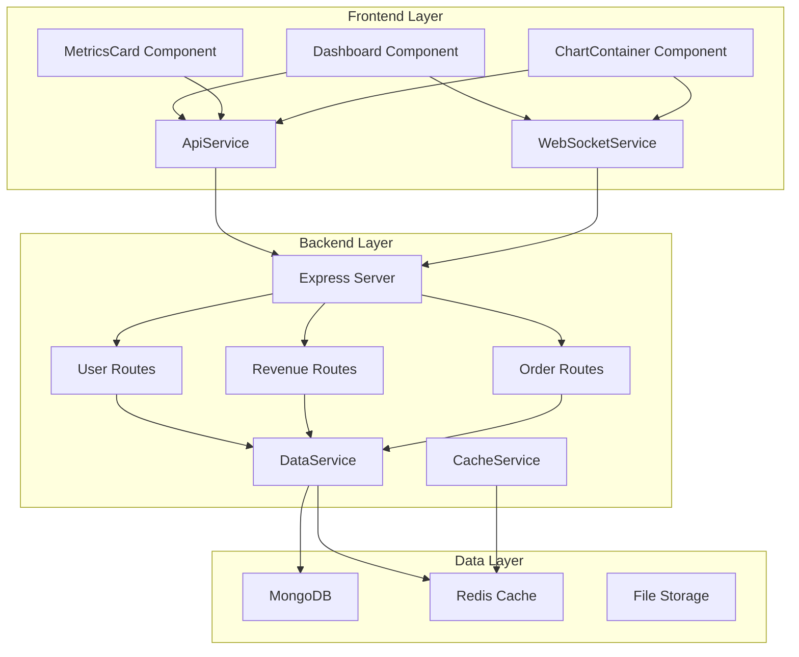
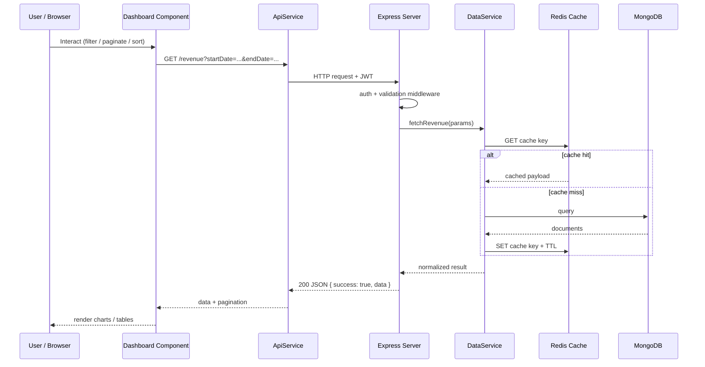
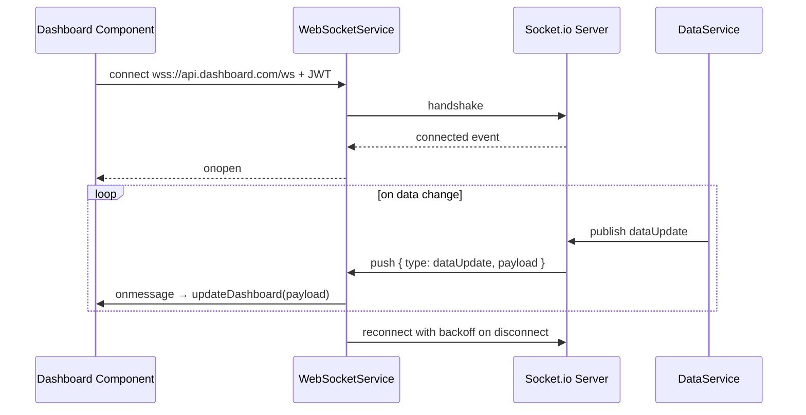
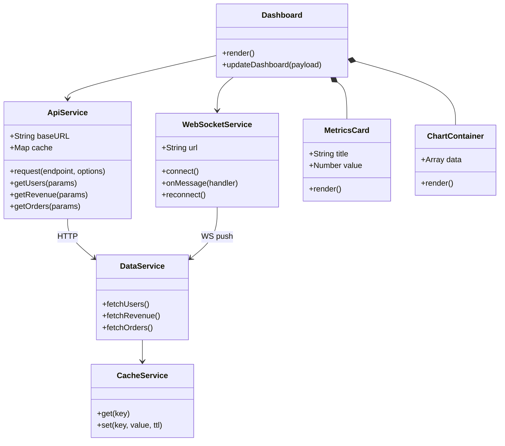

# UML Diagrams — Advanced Dashboard System

Comprehensive UML / architecture diagrams for the system (Task 2).

Renders on GitHub, GitLab, VS Code (Markdown Preview Mermaid Support), and most docs sites.

## 1. System Component Diagram

### How to read it

- **Frontend Layer**: `Dashboard`, `MetricsCard`, `ChartContainer` talk to the backend only through `ApiService` (REST) and `WebSocketService` (real-time).
- **Backend Layer**: Express routes (`users`, `revenue`, `orders`) delegate to `DataService`; `CacheService` fronts Redis.
- **Data Layer**: MongoDB is the source of truth, Redis is the cache, File Storage holds static assets/exports.

## 2. Request/Response Sequence (REST)

## 3. Real-Time Update Sequence (WebSocket)

## 4. Class / Module Overview (simplified UML)

See also:

- [System Architecture](./system-architecture.md)
- [API Documentation](./api-documentation.md)
