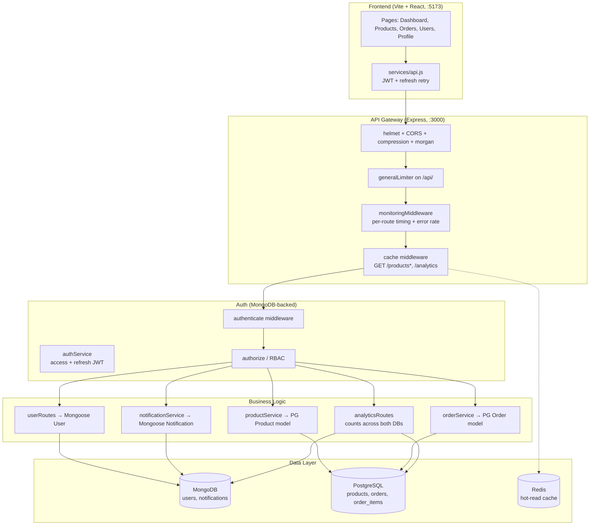

# System Architecture — Day 14 (as built)

Notes on the mapping (the part worth learning): each store owns one domain —
documents where the shape is flexible (users, notifications → Mongo),
relations + transactions where integrity matters (catalog, orders → Postgres),
ephemeral hot reads (Redis, degrades gracefully when down). Cross-database
references (Postgres `orders.user_id` → Mongo user id) are `TEXT`, never
foreign keys — enforced in service code. `/health` is public,
`/health/metrics` is admin-only.
